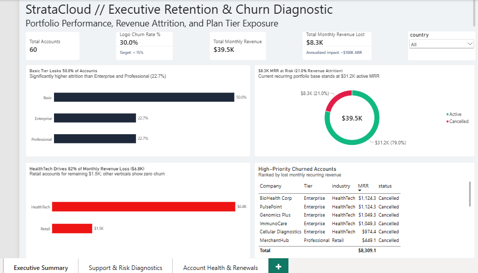
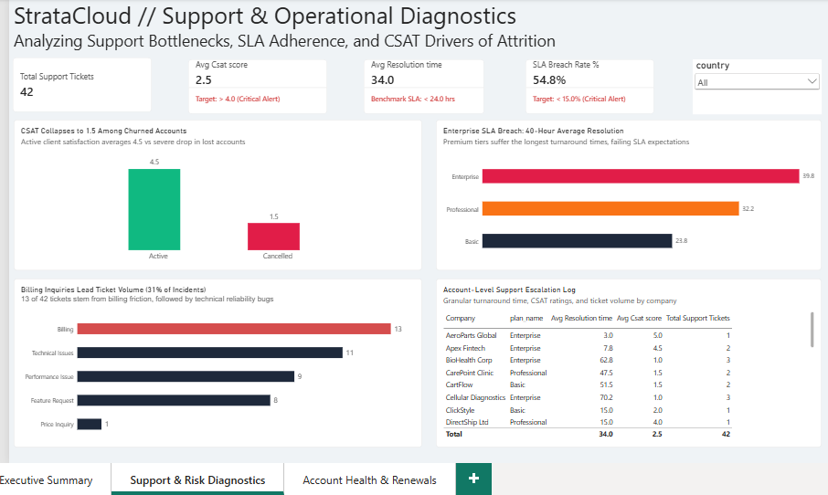
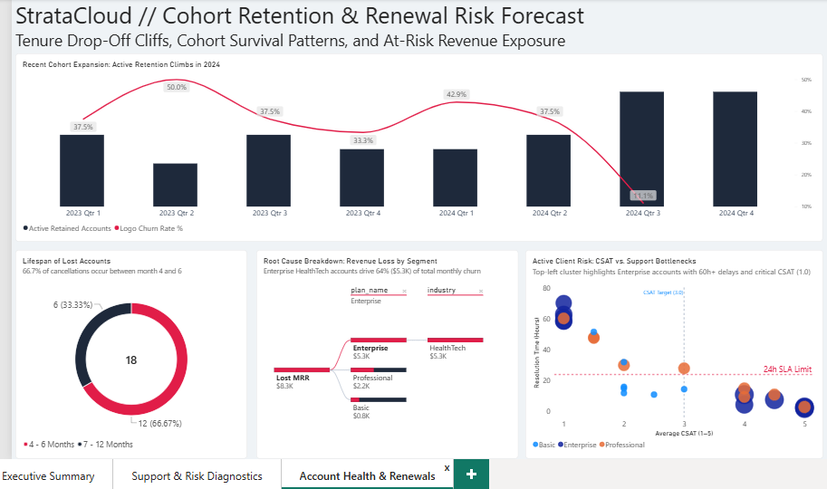

# StrataCloud // B2B SaaS Retention & Churn Diagnostic

An end-to-end diagnostic analytics project built to uncover revenue leakage, diagnose customer support delivery bottlenecks, and provide proactive account health triage before contract renewals.

---

## Executive Summary & Business Problem

StrataCloud operates on a tiered B2B subscription model (Basic, Professional, Enterprise). Over recent quarters, net recurring revenue experienced unexpected contraction due to an elevated **30.0% logo churn rate**, resulting in **$8.3K in lost Monthly Recurring Revenue (MRR)** (~$100K annualized ARR impact).

The objective of this project was to establish an operational analytics framework to answer four core questions:
1. **Financial Exposure:** Which subscription tiers and client industries account for the majority of lost revenue?
2. **Operational Root Cause:** How do support turnaround delays (SLAs) and client satisfaction scores (CSAT) correlate with cancellations?
3. **Tenure Drop-Off Windows:** When in the customer lifecycle does attrition occur?
4. **Proactive Account Triage:** Which currently active accounts are showing the exact warning signs that preceded historical churn?

---

## Technical Stack & Architecture

- **Database:** MySQL Workbench (Relational schema, analytical views, window/aggregation logic)
- **BI Platform:** Microsoft Power BI Desktop (Star schema modeling, complex DAX, multi-coordinate visuals)
- **Data Modeling:** Analytical views feeding a star-schema architecture separating dimensional attributes from transactional logs


## Data Pipeline & SQL Transformations

Rather than relying on static flat files, the foundational dataset was architected directly in **MySQL Workbench** to mirror enterprise transactional systems:

* **Relational Schema:** Modeled tables for account firmographics (`dim_accounts`), subscription contracts (`fact_subscriptions`), and support incident logs (`fact_support_tickets`).
* **Relational Joins:** Implemented multi-table `LEFT JOIN` operations connecting subscription states with support ticket interaction histories.
* **Analytical Queries & Views:** Authored aggregations and conditional CTEs directly in SQL to calculate:
  - Account-level baseline logo churn and revenue attrition percentages.
  - Plan-tier churn rates and average discounting impacts.
  - Comparative resolution times and CSAT scores between active and churned clients.
  - Ticket incident driver volumes ranked by frequency.

---

## Dashboard Walkthrough & Analytical Insights

### Page 1: Executive Retention & Churn Diagnostic
*Focus: Overall portfolio health, revenue exposure, and tier-specific attrition.*



* **Baseline Loss:** 18 out of 60 accounts cancelled (30.0% logo churn vs. < 15% target), wiping out $8.3K of the $39.5K monthly revenue baseline.
* **Plan Tier Risk:** While the Basic plan experienced the highest raw logo drop-off rate (50.0%), financial loss was heavily concentrated in high-value Enterprise and Professional contracts.
* **Vertical Vulnerability:** **HealthTech accounts drove 82% ($6.8K) of all lost MRR**, pinpointing a specific segment-level retention issue.
* **High-Priority Account Ledger:** Detailed breakdown isolating top churned enterprise logos (e.g., BioHealth Corp, PulsePoint).

---

### Page 2: Support & Operational Diagnostics
*Focus: Correlating service delivery bottlenecks directly with customer churn.*



* **SLA Failure:** The overall support SLA breach rate reached 54.8% across 42 logged tickets.
* **Enterprise Resolution Bottleneck:** Enterprise accounts experienced an average resolution time of **39.8 hours**—well above the 24.0-hour SLA limit.
* **CSAT Divergence:** Active accounts maintain a healthy average CSAT of 4.5, while accounts that ultimately cancelled collapsed to an average of **1.5**.
* **Primary Friction Drivers:** Billing inquiries accounted for 31% (13 of 42) of all support tickets, followed by technical bugs and performance issues.

---

### Page 3: Cohort Retention & Renewal Risk Forecast
*Focus: Lifecycle drop-off cliffs and forward-looking triage of active accounts.*



* **The "Mid-Contract Cliff":** The lifespan distribution shows that **66.7% (12 of 18) of all cancellations occur between months 4 and 6**, identifying the post-onboarding transition as the critical risk window.
* **Root-Cause Decomposition Tree:** Dynamically isolates that 64% ($5.3K) of churned MRR flows directly through Enterprise HealthTech accounts.
* **Active Account Risk Quadrant (4-Quadrant Scatter):**
  * Plots active accounts along CSAT (X-axis) and Resolution Time (Y-axis), sized by monthly revenue.
  * Quadrant reference lines set at **CSAT = 3.0** and **Resolution Time = 24.0 hours**.
  * Immediately isolates active Enterprise accounts stuck at **60–80 hours resolution delay and 1.0 CSAT**, providing the Customer Success team with an exact target list for immediate retention intervention.

---

## Core DAX Formulations

```dax
-- Logo Churn Rate %
Logo Churn Rate % = 
VAR ChurnedAccounts = CALCULATE(COUNTROWS(vw_customer_retention_summary), vw_customer_retention_summary[status] = "Cancelled")
VAR TotalAccounts = COUNTROWS(vw_customer_retention_summary)
RETURN
DIVIDE(ChurnedAccounts, TotalAccounts, 0)


-- Support SLA Breach Rate %
SLA Breach Rate % = 
VAR BreachedTickets = CALCULATE(COUNTROWS(vw_support_ticket_details), vw_support_ticket_details[resolution_time_hrs] > 24.0)
VAR TotalTickets = COUNTROWS(vw_support_ticket_details)
RETURN
DIVIDE(BreachedTickets, TotalTickets, 0)


-- Project Structure
├── assets/
│   ├── Page1_Executive_Summary.png
│   ├── Page2_Support_Diagnostics.png
│   └── Page3_Account_Health_Renewals.png
├── powerbi/
│   └── StrataCloud_Retention_Diagnostic.pbix
├── sql/
│   └── 04_churn_and_retention_diagnostics.sql
└── README.md
